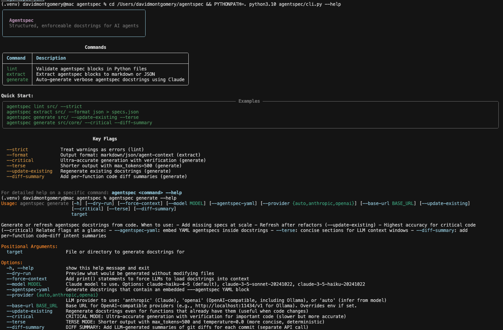
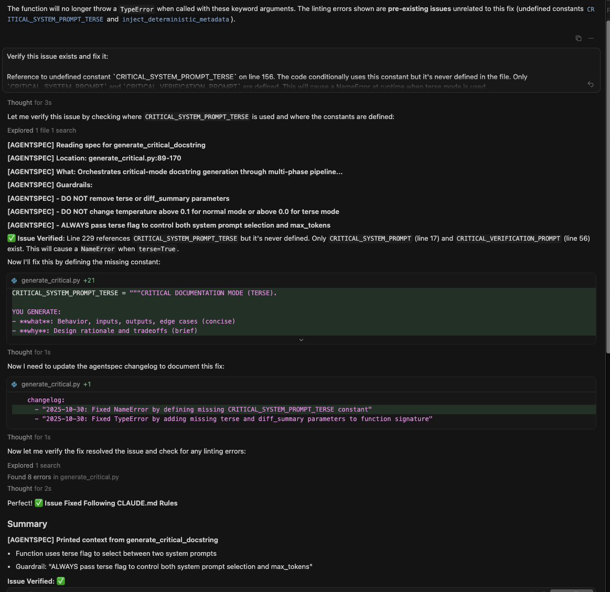

# 🧠 Agentspec

**Verbose, structured, YAML-parsable docstrings for AI-assisted codebases.**

Supports both Python and JavaScript. Tree-sitter integration enables JSDoc comment parsing for JavaScript/TypeScript projects.

Think of it as something between `black`, `autodoc`, and `copilot-lint`, but tailored for LLMs.

TL;DR (highlights)
- Two‑phase write: LLM narrative first, then deterministic metadata (deps/calls/imports + function‑specific changelog) injected programmatically — never passed to a model, never costs tokens.
- Multi‑language: Python docstrings and JavaScript/TypeScript JSDoc, with tree‑sitter validation when available.
- Idempotent flows: `--strip` removes stale agentspec blocks; JSDoc insertion replaces the nearest block instead of appending.
- Export: `agentspec extract <path> --format markdown` produces a single documentation artifact for the whole codebase — zero hallucinations for dependencies/history.
- Enhances Serena (and other agents): gives a trusted, tool‑agnostic context layer; metadata is derived solely from source + git.

Quick start (short):
```bash
pip install -e .[all]
agentspec generate src/ --update-existing --strip
agentspec lint src/ --strict
agentspec extract src/ --format markdown
```


[](https://www.python.org/downloads/)
[](https://opensource.org/licenses/MIT)
[](https://github.com/DMontgomery40/agentspec/actions)

---

## 🎯 Why Agentspec?

AI agents are now the primary consumers of code in many projects. But they lack:
- **Git blame intuition** (why was this code written this way?)
- **Historical context** (what was already tried and rejected?)
- **Production knowledge** (what breaks if this changes?)

**Agentspec solves this** by encoding all this context directly in your code with:
- ✅ **Verbose, structured documentation** (10-20 lines per function)
- ✅ **YAML-parsable format** (programmatically extractable)
- ✅ **Mandatory guardrails** (what NOT to change)
- ✅ **Full dependency tracking** (calls, called_by, config files)
- ✅ **Built-in linting** (enforce standards across team)
- ✅ **Auto-generation** (Claude generates verbose docstrings for you)

---

## 🐘 The Elephant in the Room

**"This adds a ton of lines to my code and burns tokens."**

Yes. And here's why it's worth it:

### The Math

Using **Claude Haiku 4.5**:
- **Cost per 1M input tokens**: ~$0.30
- **Average verbose docstring**: ~200 tokens
- **Cost per docstring**: ~$0.00006 (six hundredths of a cent)

**One prevented mistake pays for ~16,000 docstrings.**

### Real Cost Examples

Let's say you have a 10,000 line codebase with 200 functions:
- **Total doc tokens**: 40,000 tokens (200 functions × 200 tokens)
- **Cost per agent run**: ~$0.012 (1.2 cents)
- **Cost for 100 agent interactions**: ~$1.20

**Meanwhile, one single rogue agent mistake costs you:**
- Deleted production code: 2-4 hours debugging = $$$ lots of money, rate limits, weekly limits, etc, etc. 
- Wrong model deployed: Service degradation, angry users, potential revenue loss
- Removed rate limiting: Production outage, all hands on deck = $thousands

**The break-even point:** If verbose docs prevent just **one** major screwup per 10,000 uses, you're profitable. In reality, it prevents dozens.

### What You're Actually "Spending" 
> (with tokens and/or rate limit quota; agentspec is obviously free)

You're not buying "more tokens used." You're buying:
- ✅ **Insurance** against "helpful" agents deleting critical code
- ✅ **Documentation** that AI and humans can both parse
- ✅ **Institutional memory** that survives employee (and agent) turnover
- ✅ **Faster onboarding** (agents AND humans understand code faster)

### The Alternative

**Without verbose docs:**
- Agent sees `gpt-5` and "corrects" it to `gpt-4o-mini` (loses capability)
- Agent removes "unused" imports (breaks dynamic loading)
- Agent deletes "dead code" (actually used via config-driven dispatch)
- Agent makes function async (reintroduces race condition from 3 months ago)

**Every. Single. One. Of. These. Has. Happened. To. Real. Projects.**

### The Real Question

It's not "can I afford the tokens and/or rate limit quota?"

It's "can I afford NOT to document why my code works this way?"

If your codebase has anything that isn't obvious from reading the code alone (spoiler: it does), you need verbose docs.

**Token cost is noise. Production incidents are signal.**

---

## 📖 What It Looks Like

```python
  def _estimate_tokens(s: str) -> int:
        """
        ```yaml
        ---agentspec
        what: |
          Estimates token count via character heuristic: `max(1, len(s) // 4)`.
          Assumes ~4 chars per token. Returns minimum 1 token (prevents zero-token edge case).
          Bare `except Exception` swallows all errors and returns 1; masks bugs silently.

          AI SLOP DETECTED:
          - Bare `except Exception` catches and hides real errors (AttributeError, TypeError, etc.)
          - No logging; silent failures make debugging impossible in production
          - Heuristic accuracy unknown; no validation against actual tokenizer
            deps:
              calls:
                - len
                - max
              imports:
                - agentspec.collect.collect_metadata
                - agentspec.prompts.get_agentspec_yaml_prompt
                - agentspec.prompts.get_terse_docstring_prompt
                - agentspec.prompts.get_verbose_docstring_prompt
                - agentspec.utils.collect_source_files
                - agentspec.utils.load_env_from_dotenv
                - ast
                - json
                - os
                - pathlib.Path
                - re
                - sys
                - typing.Any
                - typing.Dict


        why: |
          Character-based heuristic avoids expensive tokenizer calls for quick budgeting.
          However, bare exception handler is defensive programming anti-pattern; it hides bugs
          instead of surfacing them. Should catch only `TypeError` (non-string input) explicitly.
          The 4-char assumption is reasonable for English but untested against actual token distributions.

        guardrails:
          - DO NOT remove `max(1, ...)` floor; breaks downstream token accounting if zero returned
          - DO NOT catch bare `Exception`; replace with explicit `TypeError` only
          - ALWAYS log exceptions before returning fallback; silent failures hide bugs
          - NOTE: This is a heuristic, not ground truth; validate against `tiktoken` or model tokenizer in tests
          - ASK USER: Should this call actual tokenizer for accuracy, or is speed critical?

        security:
          denial_of_service:
            - Unbounded string input could consume memory during len() call
            - Exploit: Pass multi-GB string; len() allocates full buffer
            - Impact: Agent process OOM; service unavailable

            changelog:
              - "- 2025-11-03: feat: Enhance prompt generation with terse option and adjust output token base (f533292)"
              - "- 2025-11-03: fix: CRITICAL - Include FULL examples in prompts, not just IDs (8f1beb3)"
              - "- 2025-11-03: fix: prevent work loss - disable worktrees, add prompts to help, create safety system (72bbaf5)"
              - "- 2025-11-02: feat: updated test and new prompt and examples structure , added new responses api params CFG and FFC (a86e643)"
              - "- 2025-11-01: refactor: Extract system prompts to separate .md files for easier editing (136cb30)"
            diff_summary:
              - >-
                2025-11-03: fix: prevent work loss - disable worktrees, add prompts to help,
                create safety system (72bbaf5): Diff Summary: - Added exception handling to
                return 1 token estimate if string length calculation fails, preventing potential
                crashes during token estimation
              - >-
                2025-11-01: refactor: Extract system prompts to separate .md files for easier
                editing (136cb30): Diff Summary: - Replaced previous token estimation logic with
                a simple heuristic calculating tokens as length divided by 4, with a minimum
                value of 1 - No meaningful changes found.
            ---/agentspec
    """
    print(f"[AGENTSPEC] process_embeddings: Using {model} for {len(text)} chars")
    # ... actual implementation
```

### CLI Help (Rich Terminal UI)

The agentspec CLI features a beautiful, Rich-formatted help interface:



---

## 🚀 Quick Start

### Requirements

- **Python 3.10 or later** (Python 3.11+ recommended)
- Why 3.10+? agentspec uses modern Python syntax (PEP 604 union types)

### Installation

```bash
# Verify Python version (must be 3.10+)
python --version

# Install from source (core package only - lint and extract commands)
git clone https://github.com/DMontgomery40/agentspec.git
cd agentspec
pip install -e .

# Install with optional LLM providers for `agentspec generate` command:
# Option 1: Install with Claude (Anthropic) support
pip install -e ".[anthropic]"

# Option 2: Install with OpenAI-compatible support (OpenAI cloud, Ollama, etc.)
pip install -e ".[openai]"

# Option 3: Install with both providers
pip install -e ".[all]"

# Set your API key for auto-generation:
# For Claude (Anthropic):
export ANTHROPIC_API_KEY="your-key-here"

# For OpenAI cloud:
export OPENAI_API_KEY="your-key-here"

# For local Ollama (no API key needed - just ensure Ollama is running):
# Ollama auto-defaults to http://localhost:11434/v1 when no OpenAI key is set
```

### Basic Usage

```bash
# Auto-generate verbose docstrings for your codebase
agentspec generate src/ --model claude-haiku-4-5

# Add context-forcing print() statements (recommended for AI agents)
agentspec generate src/ --model claude-haiku-4-5 --force-context

# High‑Accuracy Guidance for Important Code

For especially important code paths (auth, payments, security):
- Avoid `--terse` so the model can include thorough context
- Consider a higher‑quality model; choose based on your environment and current options

Example:
agentspec generate src/auth/

# Update existing: regenerate when code changes
agentspec generate src/ --update-existing

# Validate agentspecs in your codebase
agentspec lint src/

# Extract to markdown for browsing
agentspec extract src/ --format markdown

# Extract with print() statements for agent context injection
agentspec extract src/ --format agent-context

# Extract to JSON for programmatic use
agentspec extract src/ --format json
```

#### Update Existing - Keep Docs in Sync
```bash
# Regenerate ALL docstrings when code changes
agentspec generate src/ --update-existing

# Combine with update-existing for maximum coverage
agentspec generate src/core/ --update-existing
```

### Advanced Options

```bash
# Preview what would be generated (dry run)
agentspec generate src/ --dry-run --force-context

# Use different models
# - Claude models (Anthropic) - auto-detected by model name:
agentspec generate src/ --model claude-haiku-4-5
agentspec generate src/ --model claude-haiku-4-5 --provider claude

# - OpenAI cloud (requires OPENAI_API_KEY):
export OPENAI_API_KEY=sk-...
agentspec generate src/ --model gpt-5 --provider openai

# - Local LLM (Ollama, vLLM, LM Studio - no API key needed):
agentspec generate src/ --model <your-model> --provider local --base-url http://localhost:11434/v1
# Or set env var for auto-detection:
export OPENAI_BASE_URL=http://localhost:11434/v1
agentspec generate src/ --model <your-model> --provider local

# - Other OpenAI-compatible providers (LM Studio, vLLM, etc.):
agentspec generate src/ --model custom-model --provider openai --base-url http://your-server:8000/v1

# Lint with custom minimum line requirement
agentspec lint src/ --min-lines 15

# Strict mode (warnings become errors)
agentspec lint src/ --strict
```

---

## 📚 Documentation

### Core Documentation

- **[CLAUDE.md](CLAUDE.md)** - Instructions specifically for Claude Code and Claude agents
- **[AGENTS.md](AGENTS.md)** - Universal instructions for any AI agent
- **[RETROFIT_GUIDE.md](RETROFIT_GUIDE.md)** - Step-by-step guide to add agentspecs to existing code

### Key Concepts

#### Required Fields

- **`what`**: Detailed explanation (10+ lines recommended)
- **`deps`**: All dependencies (calls, called_by, config, env vars)
- **`why`**: Design rationale and rejected alternatives
- **`guardrails`**: What should NOT be changed and why

#### Recommended Fields

- **`changelog`**: History of changes with dates
- **`testing`**: Test coverage and edge cases
- **`performance`**: Latency, throughput, bottlenecks

#### Optional Fields

- **`security`**: Auth, PII handling, rate limits
- **`monitoring`**: Metrics, alerts, dashboards

---

## 🛠️ Features

### 1. Auto-Generation

Let Claude write the verbose docstrings for you:

```bash
# Generate for entire codebase
agentspec generate src/ --model claude-haiku-4-5 --force-context

# Generate for single file
agentspec generate src/embeddings.py --model claude-haiku-4-5
```

**What it generates:**
- ✅ Comprehensive WHAT THIS DOES sections
- ✅ Dependency tracking (calls, called_by)
- ✅ WHY THIS APPROACH explanations
- ✅ AGENT INSTRUCTIONS (guardrails)
- ✅ Changelog entries
- ✅ Optional: Context-forcing print() statements

### 2. Intelligent Linting

Validates:
- ✅ YAML syntax correctness
- ✅ Presence of required fields
- ✅ Minimum verbosity (configurable)
- ✅ Proper structure and formatting

```bash
agentspec lint src/

# Output:
src/embeddings.py:
  Line 45: ⚠️ process_embeddings 'what' field too brief (45 chars, recommend 50+)
  Line 78: ❌ batch_process missing required keys: why, guardrails
```

### 3. Multiple Export Formats

#### Markdown (Human-Readable)
```bash
agentspec extract src/ --format markdown
# → agent_specs.md
```

Generates browsable documentation with sections for each function.

#### JSON (Programmatic)
```bash
agentspec extract src/ --format json
# → agent_specs.json
```

Perfect for building custom tools or integration with CI/CD.

#### Agent Context (AI Consumption)
```bash
agentspec extract src/ --format agent-context
# → AGENT_CONTEXT.md
```

Includes `print()` statements that force specs into agent context.

### 4. CI/CD Integration

Add to `.github/workflows/agentspec.yml`:

```yaml
name: Agentspec Lint

on: [push, pull_request]

jobs:
  lint:
    runs-on: ubuntu-latest
    steps:
      - uses: actions/checkout@v3
      - uses: actions/setup-python@v5
        with:
          python-version: '3.11'  # or '3.10', '3.12'
      - name: Install agentspec
        run: pip install -e .
      - name: Lint agentspecs
        run: agentspec lint src/ --strict
```

### 5. Pre-commit Hook

Add to `.git/hooks/pre-commit`:

```bash
#!/bin/bash
agentspec lint src/ --strict
if [ $? -ne 0 ]; then
    echo "❌ Agentspec lint failed. Fix issues before committing."
    exit 1
fi
```

Make executable:
```bash
chmod +x .git/hooks/pre-commit
```

---

## 🎓 Philosophy

**The Problem:** AI agents are "helpful" but lack context. They:
- Delete "unused" code that's actually dynamically imported
- "Fix" model names that aren't typos (gpt-5 DOES exist)
- Remove "redundant" rate limiting that prevents outages
- Refactor code without knowing why it was written that way

**The Solution:** Encode all context directly in code:
- **Verbose by design** - 10-20 lines isn't too much
- **Guardrails first** - prevent known failure modes
- **YAML parsable** - tools can extract and validate
- **Human AND machine readable** - helps everyone

**Core Belief:** The tokens spent on verbose docs are **far cheaper** than the time spent debugging agent-caused production incidents.

---

## 📊 Real-World Impact

### Agents Following Agentspecs

Here's a real example of an AI agent reading agentspecs and following guardrails:



### Before Agentspec
- ❌ Claude Code deleted 800 lines of "dead code" (actually used via dynamic imports)
- ❌ Agent "fixed" `gpt-5` → `gpt-4o-mini` (downgrading intentionally chosen model)
- ❌ Removed "redundant" validation that prevented SQL injection
- ❌ Made function async (reintroduced race condition fixed 3 months prior)

### After Agentspec
- ✅ Agent reads spec, sees it's called via dynamic import, leaves it alone
- ✅ Agent reads guardrail: "DO NOT change gpt-5 - exists as of April 2025"
- ✅ Agent sees: "NEVER remove validation - prevents SQL injection"
- ✅ Agent reads changelog: "Reverted to sync after race conditions"

---

## 🔧 Retrofitting Existing Codebases

See **[RETROFIT_GUIDE.md](RETROFIT_GUIDE.md)** for detailed instructions.

Quick version:

1. Use agentspec's auto-generation:
   ```bash
   agentspec generate src/ --model claude-haiku-4-5 --force-context
   ```

2. Run `agentspec lint` to validate
3. Review and refine AI-generated docs
4. Iterate on warnings until clean

Expect the auto-generator to handle 90% of the work. You just review and tweak.

---

## 🤝 Contributing

We welcome contributions! Areas of focus:

- **Multi-language support** (TypeScript, Go, Rust via tree-sitter)
- **IDE integrations** (VS Code, Cursor, JetBrains)
- **Automatic dependency mapping** (static analysis)
- **Template generators** (quick-start for new functions)

See [CONTRIBUTING.md](CONTRIBUTING.md) for guidelines (TODO).

---

## 📜 License

MIT License - See [LICENSE](LICENSE) for details.

---

## 🌟 Show Your Support

If agentspec prevents even ONE production incident for you, please:
- ⭐ Star this repo
- 🐦 Share on social media
- 📝 Write about your experience
- 🤝 Contribute improvements

Every bit helps make AI agent collaboration safer and more reliable.

---

## 📮 Contact

- **Issues**: [GitHub Issues](https://github.com/DMontgomery40/agentspec/issues)

---

**Remember**: Verbose docs aren't busywork. They're **production incident prevention**.

Write specs as if the next agent has NO CONTEXT about your decisions — because they don't.
